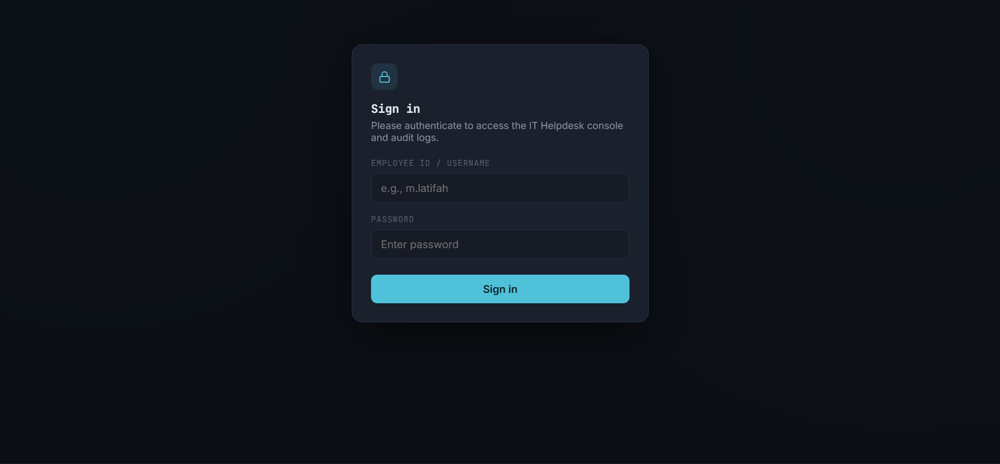
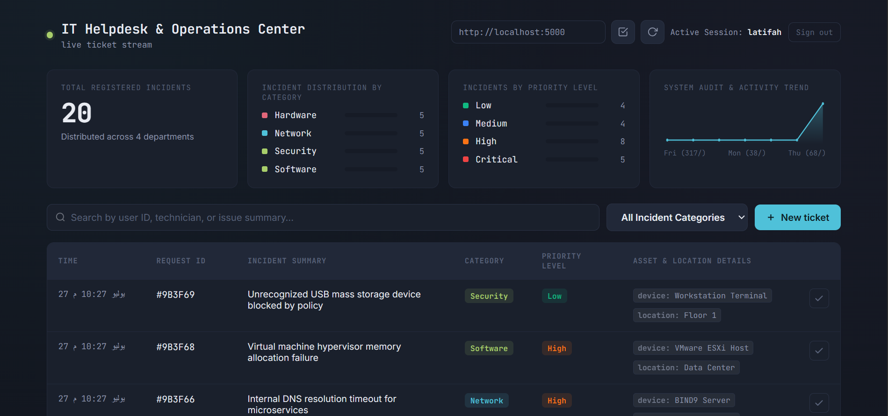
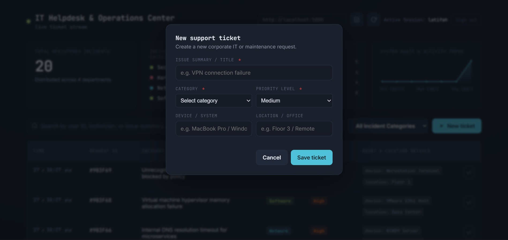
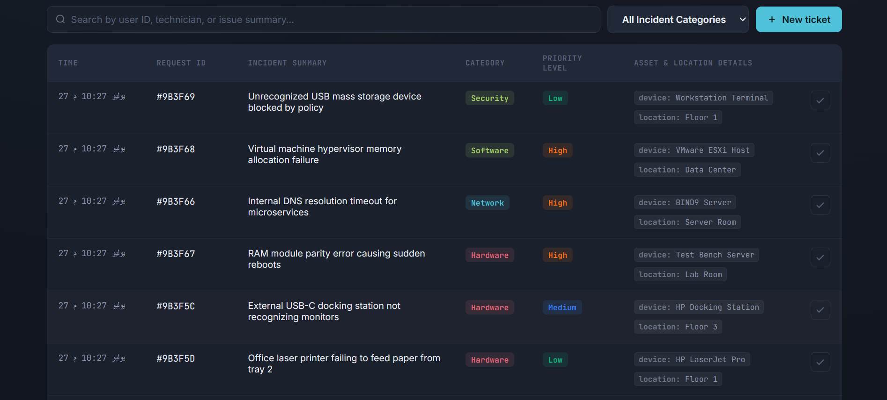
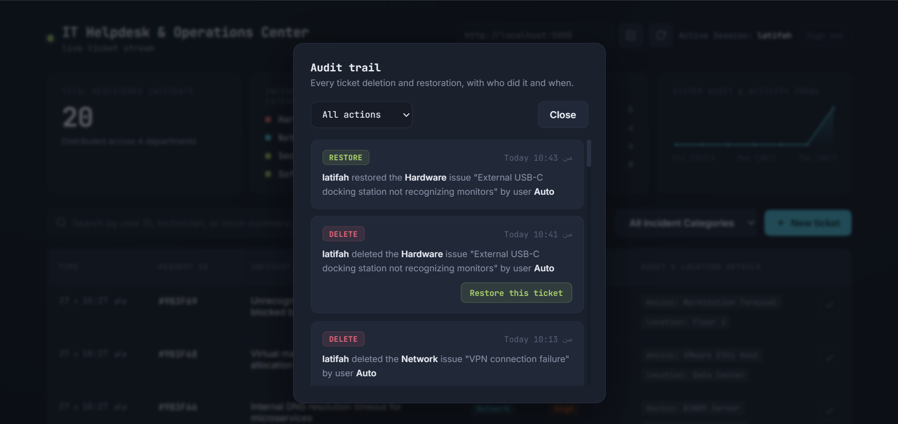

# IT Helpdesk & Operations Center
> A complete IT service management system for handling support tickets, monitoring operations, and maintaining secure audit trails.

## 📋 Overview

The **IT Helpdesk & Operations Center** helps IT teams manage support tickets, track system operations, and maintain a secure history of all administrative actions. All IT problems are tracked from reporting to resolution.

**Key Capabilities:**
- Complete ticket lifecycle management
- Immutable audit trail
- Real-time dashboard with analytics
- API key-based security
- Soft-delete with restore functionality

---

<div align="left">

### Login Screen

> Secure authentication with API key

### Dashboard

> Real-time statistics and activity monitoring

### Create Ticket

> Simple form for submitting support requests

### Ticket Management

> Search, filter, and manage all tickets

### Audit Trail

> Complete audit log with restore functionality

</div>

---


## ✨ Features

### Ticket Management
- Create, view, update, and close tickets
- Categories: Hardware, Software, Network, Security, General
- Priority levels: Critical, High, Medium, Low
- Track devices and locations

### Live Dashboard
- Real-time ticket statistics
- Category distribution charts
- Priority breakdown
- Daily activity trends

### Secure Audit Trail
- Immutable logging of all actions
- Track deletions and restorations
- Record who performed actions and when
- Full snapshot capture

### Search & Filters
- Instant ticket search
- Filter by category, priority, and status
- Pagination support

---

## 🛠️ Tech Stack

| Layer | Technology |
|-------|-----------|
| **Frontend** | React 18.2, Vite, CSS3 |
| **Backend** | Node.js, Express.js |
| **Database** | MongoDB, Mongoose |
| **Auth** | API Key (Header-based) |

---

## 🚀 Quick Start

### Prerequisites

- Node.js v16+
- MongoDB 4.4+

### Installation

```bash
# Clone repository
git clone https://github.com/latifahTech/it-helpdesk-operations-center.git
cd it-helpdesk-operations-center

# Install server dependencies
cd server
npm install

# Install client dependencies
cd ../client
npm install

# Return to root
cd ..
```

### Configuration

**Server `.env` (in server/ directory):**
```env
PORT=5000
MONGO_URI=mongodb://localhost:27017/helpdesk
API_KEY=your_secure_api_key_here
```

**Client `.env` (in client/ directory):**
```env
VITE_API_URL=http://localhost:5000
```

### Running the Application

```bash
# Start server (from server directory)
node server.js

# Start client (in new terminal, from client directory)
npm run dev
```

Access the app at http://localhost:5173

---

## 📖 API Documentation

### Authentication Headers

| Header | Value | Required |
|--------|-------|----------|
| `x-api-key` | Your API key from `.env` | Yes |
| `x-actor` | Username (e.g., j.doe) | Yes |

### Endpoints

| Method | Endpoint | Description |
|--------|----------|-------------|
| `GET` | `/api/health` | Health check (public) |
| `POST` | `/api/tickets` | Create ticket |
| `GET` | `/api/tickets` | Get all tickets (paginated) |
| `GET` | `/api/tickets/stats` | Get dashboard statistics |
| `DELETE` | `/api/tickets/:id` | Soft-delete ticket |
| `POST` | `/api/tickets/:id/restore` | Restore ticket |
| `GET` | `/api/audit` | Get audit logs |

### Example: Create Ticket

```bash
curl -X POST http://localhost:5000/api/tickets \
  -H "Content-Type: application/json" \
  -H "x-api-key: your_api_key" \
  -H "x-actor: j.doe" \
  -d '{
    "action": "VPN connection failure",
    "category": "Network",
    "priority": "High",
    "device": "MacBook Pro",
    "location": "Floor 3"
  }'
```

**Query Parameters for GET endpoints:**

| Parameter | Type | Description |
|-----------|------|-------------|
| `category` | string | Filter by category |
| `search` | string | Search in action/userId |
| `page` | number | Page number (default: 1) |
| `limit` | number | Items per page (default: 10) |

---

## 📁 Project Structure

```
it-helpdesk-operations-center/
├── client/
│   ├── src/
│   │   ├── components/
│   │   │   ├── AuditPanel.jsx        # Audit log viewer with restore
│   │   │   ├── Header.jsx            # App header
│   │   │   ├── LoginGate.jsx         # Authentication form
│   │   │   ├── LogsTable.jsx         # Ticket display table
│   │   │   ├── NewLogModal.jsx       # Create ticket modal
│   │   │   ├── Pagination.jsx        # Pagination controls
│   │   │   ├── StatsPanel.jsx        # Dashboard statistics
│   │   │   ├── ToastContainer.jsx    # Notifications
│   │   │   └── Toolbar.jsx           # Search and filters
│   │   ├── utils/
│   │   │   └── index.js              # Utility functions
│   │   ├── App.jsx                   # Main application
│   │   ├── main.jsx                  # Entry point
│   │   └── styles.css                # Global styles
│   ├── index.html
│   ├── package.json
│   └── vite.config.js
│
├── server/
│   ├── models/
│   │   ├── Ticket.js                 # Ticket schema
│   │   └── AuditLog.js               # Audit log schema
│   ├── middleware/
│   │   └── auth.js                   # API key authentication
│   ├── server.js                     # Express server entry
│   ├── package.json
│   └── .env.example
│
├── .gitignore
└── README.md
```

---

## 🗺️ Roadmap

| Status | Feature |
|--------|---------|
| ✅ | Ticket CRUD operations |
| ✅ | API key authentication |
| ✅ | Audit trail system |
| ✅ | Dashboard & analytics |
| ✅ | Search & filter |
| ⏳ | Role-based access control |
| ⏳ | Email notifications |
| ⏳ | File attachments |
| ⏳ | Slack integration |

---

## 🤝 Contributing

This is a personal portfolio project, but suggestions and feedback are welcome!

1. Fork the repository
2. Create a feature branch: `git checkout -b feature/amazing-feature`
3. Commit changes: `git commit -m 'Add amazing feature'`
4. Push: `git push origin feature/amazing-feature`
5. Open a Pull Request

---

## 👩‍💻 Author

**Latifah Al-Hussain**

Full-Stack Developer | Software Developer  
Riyadh, Saudi Arabia

For questions, feedback, or collaboration opportunities:
- LinkedIn: [linkedin.com/in/latifah-al-hussain](https://linkedin.com/in/latifah-al-hussain)
- Portfolio: [https://latifah-alhussain.pages.dev/](https://latifah-alhussain.pages.dev/)
- Email: latifah.alhussain0@gmail.com


If you find this project helpful, feel free to ⭐ the repository!

